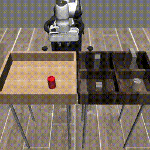
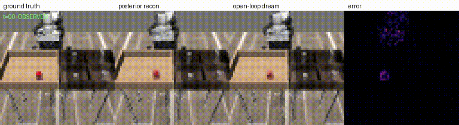

# DreamerV3 for Robotic Trajectory Planning with Franka Panda

This repository contains the implementation and experimental work for an MSc dissertation investigating the use of **DreamerV3 world-model reinforcement learning for robotic trajectory planning** using a **Franka Panda robotic arm** in the **Robosuite** simulation environment.

<p align="center">
  
</p>

The project applies DreamerV3 to the `PickPlaceCan` manipulation task and investigates not only training performance but also the reasons behind successful and unsuccessful behaviour. The implementation therefore includes training, evaluation, visualisation, and diagnostic experiments.

<p align="center">
  
</p>

---

## 1. Project Overview

The objective of this project is to investigate whether a DreamerV3-style world-model reinforcement learning agent can learn effective trajectories for robotic manipulation.

The overall pipeline is:

```text
Robosuite / Panda Environment
            │
            ▼
      Observation
            │
            ▼
      DreamerV3 Agent
            │
      ┌─────┴─────┐
      │           │
      ▼           ▼
  World Model   Actor-Critic
      │           │
      │     Imagined Trajectories
      │           │
      └─────┬─────┘
            ▼
          Action
            │
            ▼
       Panda Robot
            │
            ▼
        Environment
```

The project focuses particularly on:

* World-model-based reinforcement learning
* DreamerV3
* Robotic trajectory planning
* Franka Panda manipulation
* Robosuite simulation
* Sparse-reward learning
* Training stability
* Policy behaviour
* Failure diagnosis
* Reconstruction and imagination analysis
* Comparison against a random-policy baseline

---

## 2. Main Research Task

The main environment used in this project is:

**Robosuite `PickPlaceCan`**

The task requires the Franka Panda robot to interact with an object and perform the required manipulation sequence.

The agent receives observations from the simulated robot environment and learns an action policy through DreamerV3.

The project investigates whether the learned world model can support effective planning through imagined future trajectories.

---

## 3. Repository Structure

The repository is organised around the training, evaluation, and diagnostic components.

A typical structure is:

```text
DreamerV3_trajectory_planning/
│
├── scripts/
│   ├── train.py
│   └── evaluate.py
│
├── DreamerV3_train_v4.py
│
├── README.md
│
├── requirements.txt
│
├── configs/
│
├── checkpoints/
│
├── results/
│
├── logs/
│
└── ...
```

> The exact contents may vary depending on the experiment or branch. Large training outputs, checkpoints and generated files should generally not be committed to GitHub.

---

# 4. Requirements

The project was developed using Python and requires a working scientific-computing environment.

Recommended:

* Python 3.10 or newer
* Git
* pip
* Robosuite
* MuJoCo
* NumPy
* PyTorch/JAX components required by the implementation
* Matplotlib
* Weights & Biases (optional, for experiment tracking)

For the official DreamerV3 implementation, the current upstream repository specifies Python 3.11+ and uses JAX together with its dependency stack.

---

# 5. Clone the Repository

Open a terminal and clone the repository:

```bash
git clone https://github.com/deepchand41/DreamerV3_trajectory_planning.git
```

Enter the project directory:

```bash
cd DreamerV3_trajectory_planning
```

Check the repository:

```bash
git status
```

---

# 6. Create a Virtual Environment

Creating a separate Python environment is strongly recommended so that the project dependencies do not interfere with other projects.

Using `venv`:

```bash
python3 -m venv .venv
```

Activate it on Linux/macOS:

```bash
source .venv/bin/activate
```

On Windows:

```powershell
.venv\Scripts\activate
```

After activation, verify Python:

```bash
python --version
```

---

# 7. Upgrade pip

```bash
python -m pip install --upgrade pip
```

---

# 8. Install Project Dependencies

If `requirements.txt` is present in the repository:

```bash
pip install -r requirements.txt
```

If dependencies are being installed manually, install the core packages used by the project and then install Robosuite/MuJoCo:

```bash
pip install numpy
pip install matplotlib
pip install robosuite
```

Install the remaining dependencies specified by the repository's `requirements.txt`.

For DreamerV3 itself, the official implementation similarly recommends installing JAX followed by the project's requirements.

---

# 9. Verify Robosuite Installation

Before running DreamerV3, verify that Robosuite can be imported:

```bash
python -c "import robosuite; print('Robosuite installed successfully')"
```

You can also check the installed version:

```bash
python -c "import robosuite; print(robosuite.__version__)"
```

If this command completes without an error, the Robosuite Python package is available.

---

# 10. Verify MuJoCo

Check that MuJoCo can be imported:

```bash
python -c "import mujoco; print('MuJoCo installed successfully')"
```

If the project environment uses an older MuJoCo/Robosuite configuration, use the versions specified by the project's dependency file rather than mixing incompatible versions.

---

# 11. Understand the Environment

The main experimental environment is the Robosuite Panda manipulation task.

The environment provides observations describing the robot and task state.

Conceptually:

```text
Observation
    │
    ├── Robot state
    ├── Object state
    ├── End-effector information
    └── Task information
            │
            ▼
       DreamerV3 Encoder
            │
            ▼
       Latent Representation
            │
            ▼
          RSSM
            │
       ┌────┴────┐
       ▼         ▼
    Dynamics   Reward
     Model      Model
       │
       ▼
  Imagined Future
       │
       ▼
   Actor-Critic
       │
       ▼
      Action
```

---

# 12. DreamerV3 Architecture

DreamerV3 is a model-based reinforcement learning algorithm based on learning a latent world model and training the policy using imagined trajectories.

The major components are:

### Encoder

The encoder maps environment observations into a latent representation.

### RSSM World Model

The Recurrent State-Space Model maintains the agent's latent state and predicts future states.

### Reward Predictor

The world model learns to predict rewards from latent states.

### Actor

The actor learns the policy used to select actions.

### Critic

The critic estimates the value of imagined future states.

### Imagination

The trained world model is used to generate imagined trajectories without repeatedly interacting with the real environment.

This is the central principle behind DreamerV3: learning the world model from experience and using that model to train an actor-critic policy through imagined trajectories.

---

# 13. Training Pipeline

The complete training process can be summarised as:

```text
Start Environment
       │
       ▼
Collect Initial Experience
       │
       ▼
Store Transitions in Replay Buffer
       │
       ▼
Sample Training Sequences
       │
       ▼
Encode Observations
       │
       ▼
Update RSSM World Model
       │
       ├── Reconstruction
       ├── Reward Prediction
       ├── Dynamics Prediction
       └── Representation Learning
       │
       ▼
Generate Imagined Trajectories
       │
       ▼
Update Actor
       │
       ▼
Update Critic
       │
       ▼
Execute Policy in Robosuite
       │
       ▼
Collect New Experience
       │
       └──────────────► Repeat
```

---

# 14. Training Script

The main training entry point is:

```text
scripts/train.py
```

Run it using:

```bash
python scripts/train.py
```

If the script exposes command-line configuration options, check them using:

```bash
python scripts/train.py --help
```

This is recommended before starting a long training run.

---

# 15. Recommended First Test

Do not immediately start a long training run.

First check that the environment, model and training loop initialise correctly.

Run:

```bash
python scripts/train.py --help
```

Then perform a short test run using the debugging/small-step configuration supported by the script.

The purpose of the short run is to verify:

* Environment creation
* Observation dimensions
* Action dimensions
* Neural-network initialisation
* Replay-buffer operation
* World-model update
* Actor update
* Critic update
* Checkpoint creation
* Logging

Only after the short run completes successfully should a longer experiment be started.

---

# 16. Full Training

Once the installation has been verified, run the required training configuration:

```bash
python scripts/train.py
```

The exact training duration and configuration should match the experiment being reproduced.

The final dissertation experiments included training runs extending to approximately:

```text
128,000 environment steps
```

The final results should therefore be interpreted together with the corresponding configuration and saved experiment logs.

---

# 17. Experiment Tracking

The project uses experiment logging to monitor training behaviour.

Important metrics include:

* Episode reward
* Episode length
* Actor loss
* Critic loss
* World-model losses
* Reconstruction loss
* KL-related losses
* Policy entropy
* Success rate
* Task-specific performance

Where Weights & Biases is enabled, authenticate before training:

```bash
wandb login
```

Then start the training script.

The experiment dashboard can be used to inspect:

```text
Training progress
      │
      ├── Reward
      ├── Losses
      ├── Entropy
      ├── Success
      └── Model behaviour
```

---

# 18. Checkpoints

Training checkpoints should be saved during training so that experiments can be resumed and evaluated.

A typical workflow is:

```text
Training
   │
   ▼
Checkpoint
   │
   ├── Continue training
   │
   ├── Evaluate policy
   │
   └── Analyse learned model
```

Do not commit large checkpoint files directly to GitHub unless they are intentionally included as part of the release.

For large files, use an appropriate external storage mechanism.

---

# 19. Evaluation

The evaluation script is:

```text
scripts/evaluate.py
```

Run:

```bash
python scripts/evaluate.py
```

If arguments are available:

```bash
python scripts/evaluate.py --help
```

The evaluation process loads the trained model/checkpoint and runs the policy in the Panda environment without updating the model.

The evaluation pipeline is:

```text
Saved Checkpoint
       │
       ▼
Load DreamerV3 Agent
       │
       ▼
Reset Robosuite
       │
       ▼
Observation
       │
       ▼
Policy
       │
       ▼
Action
       │
       ▼
Panda Environment
       │
       ▼
Record Results
```

---

# 20. Evaluation Metrics

The main evaluation measures include:

### Task Success

Whether the manipulation task was successfully completed.

### Reward

The accumulated task reward.

### Trajectory Quality

The behaviour and efficiency of the generated trajectory.

### Policy Behaviour

The actions generated by the learned policy.

### Failure Behaviour

Repeated or unsuccessful behaviours are analysed rather than considering only the final reward.

---

# 21. Diagnostic Investigation

A major part of this project was the diagnosis of why DreamerV3 did not consistently produce successful manipulation behaviour.

The diagnostic experiments investigate:

* World-model reconstruction
* Imagination behaviour
* Policy entropy
* Actor behaviour
* Action distributions
* Sparse-reward learning
* Replay-buffer experience
* Planning/trajectory errors
* Comparison with random behaviour

The purpose is to distinguish between:

```text
Poor task performance
        │
        ├── World-model problem
        │
        ├── Policy-learning problem
        │
        ├── Reward sparsity
        │
        ├── Planning problem
        │
        └── Other implementation/environment effects
```

---

# 22. Reconstruction Analysis

The reconstruction analysis examines whether the learned world model is able to represent observations accurately.

Conceptually:

```text
Real Observation
       │
       ▼
     Encoder
       │
       ▼
   Latent State
       │
       ▼
    Decoder
       │
       ▼
Reconstructed Observation
```

The reconstruction error is then analysed over training.

Large or unstable reconstruction errors can indicate that the world model is not accurately representing the environment.

---

# 23. Imagination Analysis

DreamerV3 learns a model of the environment and uses it to generate imagined future trajectories.

The imagination process is:

```text
Current Latent State
        │
        ▼
     Policy
        │
        ▼
      Action
        │
        ▼
     RSSM
        │
        ▼
 Predicted Next State
        │
        ▼
      Repeat
        │
        ▼
Imagined Trajectory
```

The project analyses these imagined trajectories to determine whether the learned model provides useful predictions for planning.

---

# 24. Policy Analysis

The policy is analysed using measures such as:

* Action distribution
* Policy entropy
* Action saturation
* Behavioural consistency
* Trajectory progression

This helps identify cases where the policy becomes overly deterministic or repeatedly produces ineffective actions.

---

# 25. Sparse-Reward Analysis

The PickPlaceCan task presents a challenging learning problem because useful rewards may be relatively infrequent compared with the large number of interactions required to discover successful behaviour.

The project therefore examines replay-buffer experience and successful/unsuccessful trajectories to understand whether the agent receives sufficient useful learning signals.

The analysis compares:

```text
Experience collected
        │
        ▼
Replay Buffer
        │
        ├── Successful transitions
        ├── Partial-progress transitions
        └── Unsuccessful transitions
```

This provides a basis for understanding the effect of sparse reward signals on DreamerV3 training.

---

# 26. Random Policy Baseline

A random-policy baseline is included to provide a reference point for interpreting the learned agent's behaviour.

The comparison should be performed using the same evaluation environment and equivalent evaluation conditions.

Conceptually:

```text
             ┌──────────────┐
             │ Evaluation   │
             │ Environment  │
             └──────┬───────┘
                    │
             ┌──────┴──────┐
             ▼             ▼
       DreamerV3       Random Policy
             │             │
             ▼             ▼
          Results       Results
             │             │
             └──────┬──────┘
                    ▼
              Comparison
```

The random baseline is used as a statistical reference rather than as a trained alternative.

---

# 27. Reproducing the Dissertation Experiments

To reproduce the dissertation workflow, follow this order:

### Step 1 — Clone

```bash
git clone https://github.com/deepchand41/DreamerV3_trajectory_planning.git
cd DreamerV3_trajectory_planning
```

### Step 2 — Create environment

```bash
python3 -m venv .venv
source .venv/bin/activate
```

### Step 3 — Install dependencies

```bash
pip install --upgrade pip
pip install -r requirements.txt
```

### Step 4 — Verify Robosuite

```bash
python -c "import robosuite; print('Robosuite OK')"
```

### Step 5 — Test training

```bash
python scripts/train.py --help
```

Run a short training/debugging experiment.

### Step 6 — Start the main experiment

```bash
python scripts/train.py
```

Use the final experiment configuration required for the dissertation reproduction.

### Step 7 — Monitor training

Inspect the terminal output and experiment logging.

Monitor:

```text
Reward
Losses
Entropy
Success
Episode length
World-model behaviour
```

### Step 8 — Save checkpoint

Keep the checkpoint corresponding to the desired training step.

### Step 9 — Evaluate

```bash
python scripts/evaluate.py
```

### Step 10 — Generate diagnostic results

Run the relevant diagnostic scripts included in the repository.

### Step 11 — Analyse results

Compare:

```text
Training performance
        +
Evaluation performance
        +
World-model diagnostics
        +
Policy diagnostics
        +
Random baseline
```

### Step 12 — Generate dissertation figures

Use the saved logs and evaluation outputs to reproduce the figures used in the dissertation.

---

# 28. Important Experimental Runs

The dissertation contains several experimental stages rather than relying on a single training run.

The progression was broadly:

```text
Initial DreamerV3 implementation
             │
             ▼
Initial training experiments
             │
             ▼
Identify unstable/unsuccessful behaviour
             │
             ▼
Diagnostic experiments
             │
      ┌──────┼─────────┐
      ▼      ▼         ▼
   Policy  World     Replay
   tests   model     analysis
           tests
      │      │         │
      └──────┼─────────┘
             ▼
       Final experiment
             │
             ▼
      128k-step results
             │
             ▼
      Random comparison
```

This experimental progression is important because the dissertation does not simply report a final reward value; it investigates the causes of the observed performance.

---

# 29. Official DreamerV3 Reference

This project is based on the DreamerV3 methodology described by Hafner et al.

The official open-source DreamerV3 implementation is available here:

[Official DreamerV3 GitHub Repository](https://github.com/danijar/dreamerv3?utm_source=chatgpt.com)

The official implementation describes DreamerV3 as a world-model reinforcement-learning method that learns a latent representation of the environment and trains an actor-critic policy using imagined trajectories.

The official repository should be treated as the reference implementation for the general DreamerV3 architecture. This dissertation repository contains the project-specific implementation and adaptations required for the Panda/Robosuite trajectory-planning experiments.

---

# 30. Reproducibility Notes

For reproducible experiments, record:

* Python version
* Operating system
* Robosuite version
* MuJoCo version
* ML framework versions
* Random seed
* Training steps
* Model configuration
* Environment configuration
* Checkpoint used
* Evaluation conditions

A recommended experiment record is:

```text
Experiment:
Date:
Git commit:
Python:
Robosuite:
MuJoCo:
Training steps:
Random seed:
Configuration:
Checkpoint:
Evaluation episodes:
Results:
Notes:
```

Using a Git commit hash for each experiment is particularly useful because it identifies the exact code version used to produce the result.

---

# 31. Common Problems

## ImportError

If Python cannot find a package:

```bash
pip install <package-name>
```

Then verify:

```bash
python -c "import <package-name>"
```

---

## Wrong Python Environment

Check:

```bash
which python
```

and:

```bash
python --version
```

Make sure the virtual environment is activated.

---

## Robosuite/MuJoCo Error

Check that the installed Robosuite and MuJoCo versions are compatible with the versions used by the project.

Reinstall the versions specified by:

```text
requirements.txt
```

rather than independently upgrading packages.

---

## CUDA/JAX Problems

If using a GPU, make sure the installed JAX version and CUDA support are compatible.

For an initial debugging run, CPU execution can be useful where supported by the implementation.

The official DreamerV3 documentation also recommends checking CUDA/JAX compatibility when GPU initialisation fails.

---

## Out-of-Memory Error

Reduce the computational load using the configuration options provided by the training implementation.

Typical parameters that may affect memory include:

```text
Batch size
Sequence length
Model size
Number of parallel environments
Image/observation resolution
```

Do not change several parameters simultaneously when debugging; changing one variable at a time makes the cause easier to identify.

---

# 32. Git Workflow

Before committing changes:

```bash
git status
```

Review the changes:

```bash
git diff
```

Add only the files that should be committed:

```bash
git add README.md
```

Or add several specific files:

```bash
git add scripts/train.py scripts/evaluate.py README.md
```

Commit:

```bash
git commit -m "Update project documentation"
```

Push:

```bash
git push origin main
```

Avoid committing generated checkpoints, large experiment logs, virtual environments, cache directories, or other unnecessary build artifacts.

---

# 33. Recommended `.gitignore`

The repository should normally exclude generated files such as:

```gitignore
# Python
__pycache__/
*.py[cod]
.venv/
venv/
.env

# Jupyter
.ipynb_checkpoints/

# IDE
.vscode/
.idea/

# Experiment outputs
logs/
logdir/
runs/
wandb/

# Model checkpoints
checkpoints/
*.ckpt
*.pth
*.pt

# Generated results
results/
outputs/

# OS
.DS_Store
```

Modify this list if particular results or checkpoints are intentionally part of the repository.

---

# 34. Project Results

The final dissertation experiments investigated DreamerV3 training for Panda trajectory planning up to approximately **128,000 training steps**.

The analysis identified that poor task performance was strongly associated with planning/trajectory-generation behaviour, while other contributing factors were also investigated.

The final analysis reported an approximate diagnostic breakdown of:

```text
Planning-related error     ≈ 83%
Other factors              ≈ 17%
```

These values are experimental findings from this project and should not be interpreted as general properties of DreamerV3.

---

# 35. Limitations

The repository represents a research implementation developed for an MSc dissertation.

Important limitations include:

* Experiments are conducted in simulation.
* Results depend on the Robosuite/MuJoCo environment configuration.
* The number of training steps is limited compared with very large-scale DreamerV3 experiments.
* Sparse rewards make learning difficult.
* Robotic manipulation introduces a more complex action/planning problem than many benchmark environments.
* Results from one manipulation task should not automatically be generalised to all robotic tasks.
* The project focuses on diagnosis and analysis rather than claiming a universally optimal DreamerV3 configuration.

---

# 36. Future Work

Possible extensions include:

* Longer training runs
* Improved reward shaping
* Curriculum learning
* Improved exploration
* Better manipulation-specific representations
* Alternative observation spaces
* Additional robotic manipulation tasks
* Sim-to-real transfer
* Real Panda hardware experiments
* Comparison with PPO, SAC and other model-free methods
* Comparison with alternative model-based RL methods
* Improved planning mechanisms
* Larger-scale world models

---

# 37. Citation

If you use the DreamerV3 methodology, please cite the original work:

```bibtex
@article{hafner2025dreamerv3,
  title={Mastering diverse control tasks through world models},
  author={Hafner, Danijar and Pasukonis, Jurgis and Ba, Jimmy and Lillicrap, Timothy},
  journal={Nature},
  year={2025},
  publisher={Nature Publishing Group}
}
```

For the dissertation implementation, please also cite this repository:

```bibtex
@misc{chand_dreamerv3_panda,
  author       = {Deepak Chand},
  title        = {DreamerV3 for Robotic Trajectory Planning with Franka Panda},
  year         = {2026},
  howpublished = {GitHub repository}
}
```

---

# 38. Acknowledgements

This project builds upon the DreamerV3 world-model reinforcement-learning framework and the open-source robotics simulation ecosystem provided by Robosuite and MuJoCo.

The official DreamerV3 implementation and documentation should be consulted for details of the original algorithm.

---

# 39. Quick Start

For convenience, the complete basic workflow is:

```bash
# Clone
git clone https://github.com/deepchand41/DreamerV3_trajectory_planning.git

# Enter repository
cd DreamerV3_trajectory_planning

# Create environment
python3 -m venv .venv

# Activate
source .venv/bin/activate

# Upgrade pip
python -m pip install --upgrade pip

# Install dependencies
pip install -r requirements.txt

# Check training options
python scripts/train.py --help

# Train
python scripts/train.py

# Evaluate
python scripts/evaluate.py
```

---

## Project Workflow

```text
                 ┌───────────────────────┐
                 │   Robosuite Panda     │
                 │     PickPlaceCan      │
                 └───────────┬───────────┘
                             │
                             ▼
                    ┌─────────────────┐
                    │   Observations  │
                    └────────┬────────┘
                             │
                             ▼
                    ┌─────────────────┐
                    │    DreamerV3    │
                    │    World Model  │
                    └────────┬────────┘
                             │
                    ┌────────┴────────┐
                    ▼                 ▼
              Real Experience    Imagination
                    │                 │
                    └────────┬────────┘
                             ▼
                    ┌─────────────────┐
                    │  Actor / Critic │
                    └────────┬────────┘
                             │
                             ▼
                         Actions
                             │
                             ▼
                    ┌─────────────────┐
                    │  Panda Robot    │
                    └────────┬────────┘
                             │
                             ▼
                       New Experience
                             │
                             └──────────► Repeat


              After Training
                     │
          ┌──────────┼──────────┐
          ▼          ▼          ▼
       Evaluate   Diagnostics  Baseline
          │          │          │
          └──────────┼──────────┘
                     ▼
              Final Analysis
```

---

## License

Add the project's applicable license here if one has been selected.

---

## Author

**Deepak Chand**

MSc Electronic and Robotics Engineering
University of West London

**Project:** DreamerV3-based Robotic Trajectory Planning with Franka Panda and Robosuite
